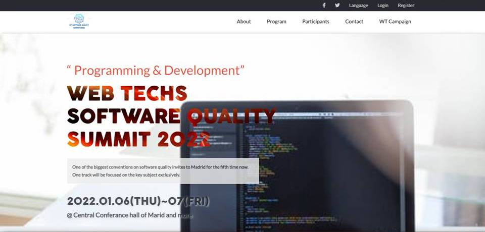

# SOFTWARE QUALITY CONFERANCE 2020

> This is a capstone project developed as a requirement in Microverse.

Additional description about the project and its features.

## Built With

- HTML & CSS
- Javascript

## Live Demo

[Live Demo Link](https://nuri1977.github.io/conferance-app/)

### Prerequisites

clone repo: `https://github.com/Nuri1977/conferance-app.git`

### Install

run `npm install` to install dependencies

👤 **Author**

- GitHub: [@Nuri1977](https://github.com/Nuri1977)
- Twitter: [@Lackanuri](https://twitter.com/LackaNuri)
- LinkedIn: [@nurilacka](https://www.linkedin.com/in/nuri-lacka-7141b01ba/)

## 🤝 Contributing

Contributions, issues, and feature requests are welcome!

Feel free to check the [issues page](../../issues/).

## Show your support

Give a ⭐️ if you like this project!

## Acknowledgments

- Hat tip to Microverse
- Icons [icon8](https://icons8.com/)
- images [pexels](https://www.pexels.com/)
- Inspiration design from [Cindy Shin in Behance](https://www.behance.net/adagio07)
- [cdnFont](https://www.cdnfonts.com/cocogoose.font)
- Free logos [brandcrowd](https://www.brandcrowd.com/)

## 📝 License

This project is [MIT](./MIT.md) licensed.